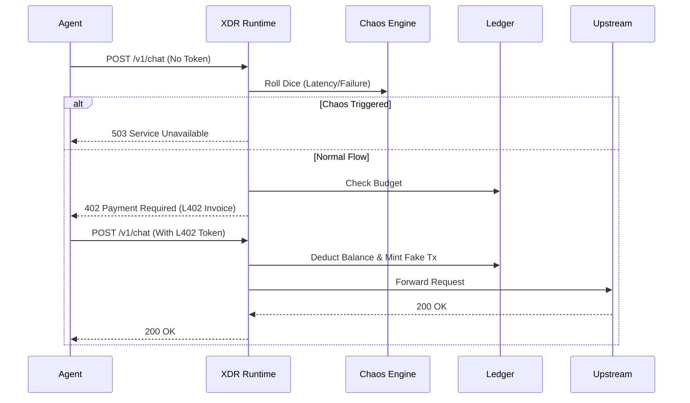

# XDR: The x402 Dev Runtime ⚒️

**Local-first runtime, simulator, and debugger for x402-powered AI agents on Cronos.**

*"The Ganache for the Agent Economy."*

Building agents that spend money is dangerous. Testing them on mainnet is expensive. XDR lets you simulate the entire Cronos x402 payment lifecycle locally—deterministic, free, and safe.


**[Watch the XDR Demo Video](https://drive.google.com/file/d/1YQvElC11huTy3zoDGaqy0mja-wTq0PzZ/view?usp=sharing)** — See the chaos engine and L402 payment flow in action.

---

## 🚧 The Developer Pain

If you are building an autonomous agent that pays for API access (LLMs, Data, Compute), you face three blockers:

- **Cost:** Integration testing burns real testnet/mainnet USDC.
- **Risk:** A `while(true)` loop in your agent can drain your wallet in seconds.
- **Fragility:** You can't easily test how your agent handles "Payment Required" (402) errors, network lags, or RPC drops without a live, hostile environment.

## 🚀 The Solution: XDR

XDR is a high-performance Reverse Proxy & Runtime written in Rust. It sits between your agent and the internet, mocking the Cronos blockchain and enforcing safety rails.


## 🏗️ Architecture
XDR is a modular workspace built for speed and safety.


---

## ✨ Key Capabilities

### 🌍 Cronos Network Simulation
- Mocks Chain ID 338 (Testnet) or 25 (Mainnet).
- Generates fake but valid-looking Transaction Hashes for every payment.
- Standardized L402 Payment Challenges compatible with any HTTP client.

### 🌪️ Deterministic Chaos Engine
- **The Lag:** Inject random latency (e.g., 500ms - 2s) to simulate mempool congestion.
- **The Drop:** Randomly fail requests (503, 429) to test agent retry logic.
- **The Rug:** Simulate payment success followed by request failure (the worst-case scenario).
- **Seeded RNG:** Replay exact failure sequences to debug your agent's recovery code.

### 💸 Budget Enforcement
- Set hard spending caps (e.g., "$5.00 USDC").
- XDR blocks requests with `402 Budget Exceeded` immediately when the cap is hit.
- Zero-Risk Dev: Never wake up to a drained wallet again.

---

## ⚡ Quick Start

### 1. Installation
Cloning the repo and building the single binary takes less than a minute.

```bash
git clone https://github.com/your-username/xdr
cd xdr
cargo build --release
```

### 2. Start the Runtime
Spin up the proxy. It listens on `http://localhost:4002`
```
cargo run -- run --network cronos-testnet
```

### 3. Point Your Agent
You don't need a special SDK. Just change your agent's BASE_URL.

Before (Production):
```
const client = new OpenAI({ baseURL: "https://api.openai.com/v1" });
```

For testing with XDR:
```
const client = new OpenAI({ 
  baseURL: "http://localhost:4002/v1", // <--- The Magic
  defaultHeaders: {
    "X-Agent-ID": "agent-007",         // Identity for the Ledger (agent name)
    "X-Upstream-Host": "api.openai.com" // Where traffic really goes
  }
});
```
## 🎮 The "Chaos" Workflow
Demonstrate your agent's resilience by breaking the network on purpose.

### Step 1: Enable Chaos
Inject a 20% failure rate and 500ms latency.
```bash
cargo run -- chaos enable --failure-rate 0.2 --min-latency 500 --seed 123
```

### Step 2: Run Your Agent
Run your agent script. You will see it handle 503 Service Unavailable and 402 Payment Required errors in real-time.

### Step 3: Inspect the Traces
XDR acts as a "Black Box" flight recorder for your agent's economics.
```bash
cargo run -- logs --agent agent-007
```

What you see:
```plaintext
------------------------------------------------
🆔 [503] POST https://api.openai.com/v1/chat/completions
   Agent: agent-007 | Duration: 502ms
   - [Chaos] Injected Network Failure: 503 Service Unavailable
------------------------------------------------
🆔 [200] POST https://api.openai.com/v1/chat/completions
   Agent: agent-007 | Duration: 150ms
   - [Payment] Payment Confirmed on Cronos (Testnet). Tx: 0x8f2a...9b1
   - [Info] Wallet: 99.99 USDC | Chain: 338
```

## 📦 Tech Stack
- Core: Rust (Edition 2021)
- Proxy: axum, hyper, tower-http
- Async Runtime: tokio
- State: dashmap (Atomic concurrent hashmap)
- CLI: clap

## 🏆 Hackathon Context
Built for: The Cronos x402 Hackathon
Track: Dev Tooling / Infrastructure
Goal: Accelerate the adoption of the Agent Economy by solving the "Developer Experience" gap.
